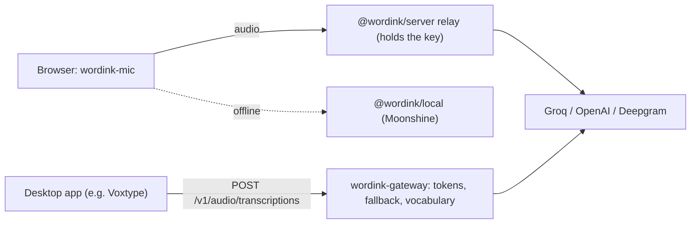

<p align="center">
  <picture>
    <source media="(prefers-color-scheme: dark)" srcset="assets/brand/lockup-dark.svg">
    
  </picture>
</p>

# WordInk

**Dictation as a component.** An open-source, provider-agnostic engine that turns speech into finished text: a drop-in `<wordink-mic>` for any web app, and an OpenAI-compatible gateway so desktop dictation apps can use your keys and fallback rules.

[](LICENSE)

> **Status: pre-release.** The Web SDK, relay, gateway and Python tooling are merged to `master` and the docs site is live. Nothing is published to npm yet. See [ROADMAP.md](ROADMAP.md) and the [program plan](docs/plans/2026-10-10-001-docs-wordink-program-plan.md). The original Windows dictation app lives in [`legacy/`](legacy/).

> Logo and brand assets in [`assets/brand/`](assets/brand/) are a proposal pending owner sign-off; see [DESIGN.md](DESIGN.md).

**Docs and live demo: <https://duketopceo.github.io/WordInk/>**

## Quickstart

The packages are not on npm yet (see Status), so the CDN URL below becomes valid after the first release. Plain HTML, no build step:

```html
<textarea id="message"></textarea>
<wordink-mic for="message" endpoint="/api/wordink"></wordink-mic>

<script
  type="module"
  src="https://cdn.jsdelivr.net/npm/@wordink/web@VERSION/dist/wordink-web.cdn.js"
  integrity="sha384-…"
  crossorigin="anonymous"
></script>
```

The [HTML quickstart](https://duketopceo.github.io/WordInk/quickstart-html.html) has the pinned version and its integrity hash. `endpoint` is your [`@wordink/server`](packages/server) relay, which holds the provider key.

React:

```tsx
import { WordInkMic } from "@wordink/react";

<textarea id="message" />
<WordInkMic htmlFor="message" endpoint="/api/wordink" />
```

- **Drop-in:** one element or one React hook, inserted at the cursor with native undo.
- **Bring your own key:** Groq (default), OpenAI or Deepgram through your own small relay (`@wordink/server`), so long-lived keys never reach the browser. Or use a local model (`@wordink/local`) that works offline.
- **No WordInk servers, no telemetry.** MIT licensed.

| Package | |
|---|---|
| [`@wordink/web`](packages/web) | The `<wordink-mic>` element (ES module and single-file CDN build) |
| [`@wordink/react`](packages/react) | `useDictation` and `<WordInkMic>` |
| [`@wordink/core`](packages/core) | The engine: Rust core as WebAssembly plus a TypeScript browser host |
| [`@wordink/local`](packages/local) | Offline speech recognition in the browser (Moonshine) |
| [`@wordink/server`](packages/server) | Fail-closed credential relay for Cloudflare Workers and Node |

## How it works



The Rust core (`crates/wordink-core`) does no I/O: it takes events and emits effects, and a host (the TypeScript browser host today) performs the I/O. The core compiles to WebAssembly at about 35 KB gzip (budget 150 KB). The gateway is a second, separate trust boundary: browsers authenticate to the relay with cookies and an Origin check, devices authenticate to the gateway with revocable bearer tokens.

**Screenshot:** TODO. The live demo is at the docs link above; a recorded capture of `<wordink-mic>` in the demo has not been added.

## Repository layout

| Path | What |
|---|---|
| `crates/wordink-core` | Rust sans-I/O dictation core (sessions, audio pipeline, provider protocols) |
| `crates/wordink-wasm` | WebAssembly bindings for the core |
| `packages/*` | npm packages: `@wordink/core`, `web`, `react`, `local`, `server` |
| `apps/docs` | The docs site and live demo (deployed to GitHub Pages) |
| `examples/*` | Plain HTML, React and relay examples |
| `legacy/` | The original Python/Windows dictation app (groq_flow lineage) |
| `docs/plans/`, `docs/research/` | Plans, the program roadmap and landscape research |
| `sdks/python` | `wordink` CLI and `wordink-mcp` server |
| `assets/brand/` | Logo, wordmark and glyph proposals |

## Develop

```bash
cargo test --workspace                       # Rust core
pnpm install && pnpm typecheck && pnpm test  # TypeScript packages
pnpm --filter @wordink/docs dev               # docs site on localhost (offers a dev-key field)
```

## Releases and docs

Changesets drives releases: add one with `pnpm changeset`, and `.github/workflows/release.yml` opens a version PR, then publishes to npm on merge through npm trusted publishing (OIDC, with provenance; no npm token is stored). The one-time npm setup is described at the top of that workflow. `.github/workflows/docs.yml` deploys `apps/docs` to GitHub Pages; it needs Settings > Pages > Source set to "GitHub Actions" once.

## The legacy Windows app

```bash
cd legacy
uv sync
uv run wordink --onboard   # setup wizard at http://localhost:18981
uv run wordink             # tray daemon
```

## Python and agents

`sdks/python` provides a `wordink` CLI (`transcribe`, `dictate`) and a `wordink-mcp` MCP server (`transcribe`, `list_models`) over the gateway. See [sdks/python/README.md](sdks/python/README.md).

## Contributing

Work on a branch, one PR per roadmap unit; `master` requires a PR and one review and is squash-only. Add a changeset (`pnpm changeset`) for any change to a published package. Read [AGENTS.md](AGENTS.md) for the architecture invariants (no I/O in the core, keys never in the browser, no telemetry).

## License

MIT, see [LICENSE](LICENSE).

## Credits

WordInk began as a fork of [groq_flow](https://github.com/ParthJain18/groq_flow) by Parth Jain (MIT). See [LICENSE](LICENSE).
